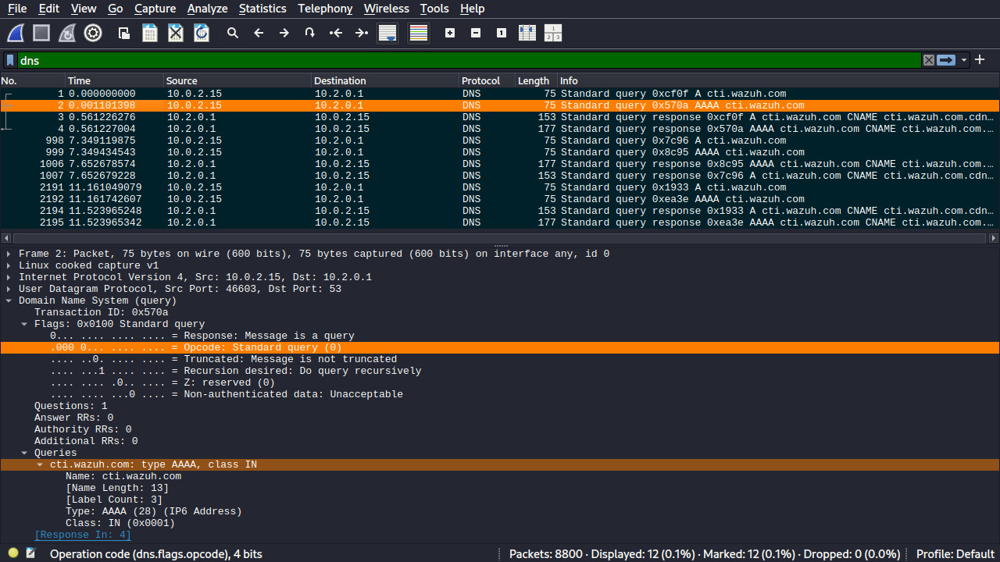
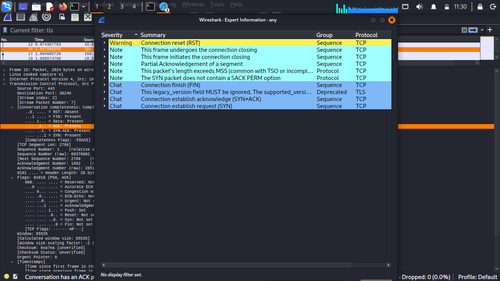
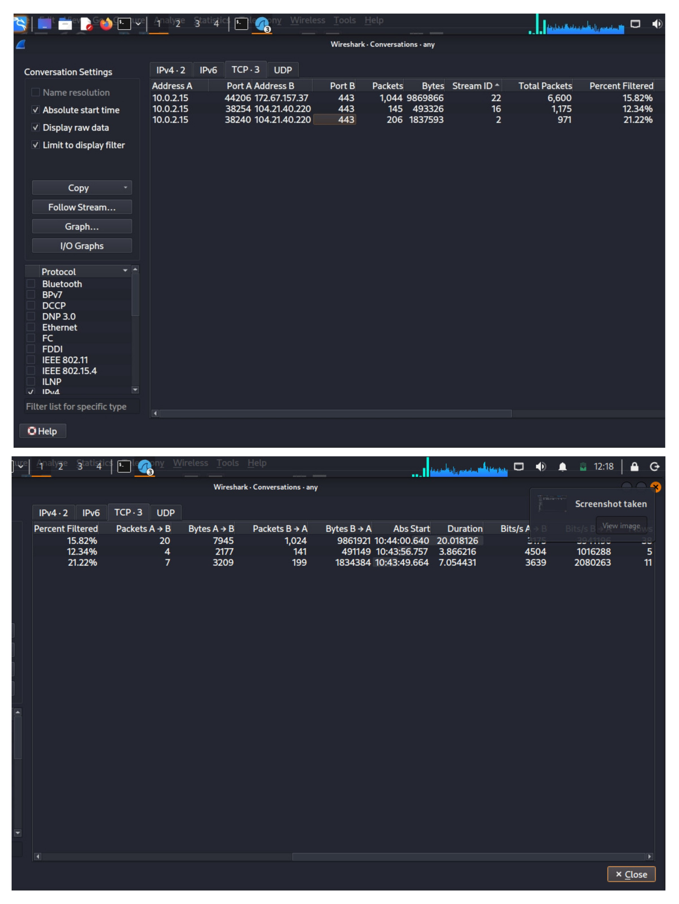

<div align="center">

# 🔍 Wireshark Network Traffic Analysis & Protocol Profiling


*A comprehensive packet-level investigation profiling transport and application layer behaviors — DNS resolution, TCP handshakes, TLSv1.3 streams, and anomaly detection.*

</div>

---

## 📖 Overview

This project demonstrates hands-on network forensics using Wireshark to capture, decode, and analyze live network telemetry. It covers the full inspection pipeline — from low-level TCP flag verification to encrypted TLS session fingerprinting — providing a security baseline for understanding how a workstation communicates with external endpoints.

---

## ✨ Features

| Feature | Description |
|---|---|
| 🌐 **DNS Protocol Dissection** | Detailed mapping of domain lookups and query/response structures |
| 🤝 **TCP Handshake Verification** | Inspection of `SYN`, `SYN-ACK`, and `ACK` flag sequences |
| 🔐 **Cryptographic Stream Analysis** | Fingerprinting of TLSv1.3 handshake parameters and cipher negotiation |
| ⚠️ **Anomaly Profiling** | Real-time extraction of TCP sequence warnings via Wireshark Expert Info |
| 📊 **Volumetric Visualization** | Monitoring packet-per-second loads using I/O Graphs |
| 🌊 **Protocol Flow Sequencing** | Bidirectional waterfall diagrams for session-level inspection |
| 💬 **Conversation Tracking** | Session-level tracking across endpoints and protocol layers |

---

## 💻 Technologies Used

- **Network Analyzer:** Wireshark v4.x
- **Virtualization:** Oracle VirtualBox
- **Guest OS:** Linux
- **Protocols Analyzed:** DNS · TCP · TLSv1.3 · IPv4 · UDP

---

## 🛠️ Installation & Setup

### Prerequisites

Install [Wireshark](https://www.wireshark.org/download.html) on your local system.

### Clone the Repository

```bash
git clone https://github.com/kunalkushwaha-tech/Wireshark-Network-Analysis.git
cd Wireshark-Network-Analysis
Open a Capture File
1.Launch Wireshark
2.Go to File → Open
3.Select a .pcapng file from the screenshorts/ directory
🕹️ Usage — Display Filters
# Filter DNS traffic only
dns

# Isolate TCP 3-way handshake (SYN packets)
tcp.flags.syn == 1

# Filter all TLS/SSL streams
tls

# Show only TLSv1.3
tls.record.version == 0x0304

# Filter Expert Info warnings
expert.severity == warn
## 📸 Analysis Captures

### 1. 🌐 DNS Resolution Mappings


### 2. 🤝 TCP 3-Way Handshake


### 3. 🔐 TLS Parameter Negotiation


### 4. ⚠️ Expert Information Diagnostics


### 5. 📊 Volumetric I/O Graph


### 6. 🌊 Protocol Flow Sequences


### 7. 💬 Session Conversations

 
📁 Repository Structure
Wireshark-Network-Analysis/
├── screenshorts/         # All 7 annotated analysis captures
├── .gitignore
├── LICENSE
├── README.md
└── requirements.txt
🎓 Learning Outcomes
• Packet Dissection — Decoded OSI Layer 4 (TCP/UDP) and Layer 7 (DNS/TLS) structural headers
• Security Baseline — Differentiated between plaintext and cryptographically secured sessions
• Network Diagnostics — Identified connection dropouts, retransmissions, and anomalies via Expert Info
• Protocol Behavior — Understood full session lifecycles from handshake to teardown.
🔮 Future Improvements
• [ ] PyShark script to automate malformed packet detection
• [ ] GeoIP database integration to map server locations
• [ ] Custom Lua dissector for proprietary protocol decoding
• [ ] Automated report generation from .pcapng captures.
👤 Author
Kunal Kushwaha
Student · Cybersecurity Intern
(https://github.com/kunalkushwaha-tech)
📄 License
MIT License — see LICENSE for details.
