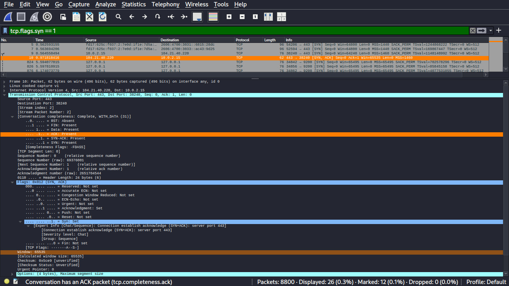
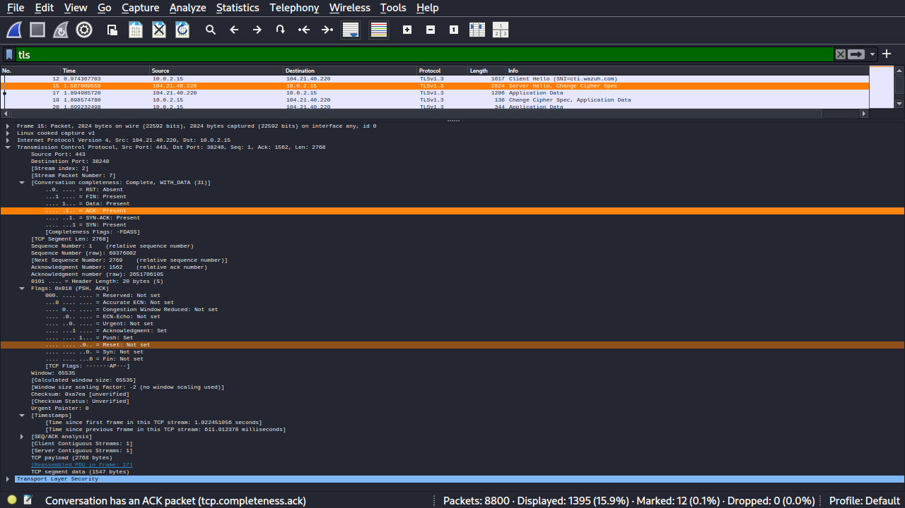
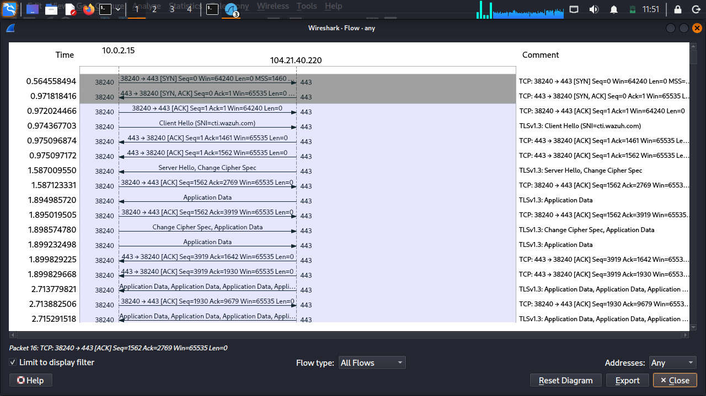
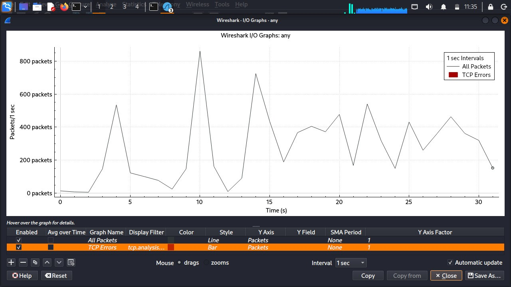

<div align="center">

# 🔍 Wireshark Network Traffic Analysis & Protocol Profiling


*A comprehensive packet-level investigation profiling transport and application layer behaviors — DNS resolution, TCP handshakes, TLSv1.3 streams, and anomaly detection.*

</div>

---

## 📖 Overview

This project demonstrates hands-on network forensics using Wireshark to capture, decode, and analyze live network telemetry. It covers the full inspection pipeline — from low-level TCP flag verification to encrypted TLS session fingerprinting — providing a security baseline for understanding how a workstation communicates with external endpoints.

---

## ✨ Features

| Feature | Description |
| :--- | :--- |
| 🌐 **DNS Protocol Dissection** | Detailed mapping of domain lookups and query/response structures |
| 🤝 **TCP Handshake Verification** | Inspection of `SYN`, `SYN-ACK`, and `ACK` flag sequences |
| 🔐 **Cryptographic Stream Analysis** | Fingerprinting of TLSv1.3 handshake parameters and cipher negotiation |
| ⚠️ **Anomaly Profiling** | Real-time extraction of TCP sequence warnings via Wireshark Expert Info |
| 📊 **Volumetric Visualization** | Monitoring packet-per-second loads using I/O Graphs |
| 🌊 **Protocol Flow Sequencing** | Bidirectional waterfall diagrams for session-level inspection |
| 💬 **Conversation Tracking** | Session-level tracking across endpoints and protocol layers |

---

## 💻 Technologies Used

| Tool | Purpose |
|------|---------|
| **Wireshark v4.x** | Network Packet Analyzer |
| **Oracle VirtualBox** | Virtualization Platform |
| **Linux** | Guest Operating System |
| **DNS · TCP · TLSv1.3 · IPv4 · UDP** | Protocols Analyzed |

---

## 🛠️ Installation & Setup

### Prerequisites

Install [Wireshark](https://www.wireshark.org/download.html) on your local system.

### Clone the Repository

```bash
git clone https://github.com/kunalkushwaha-tech/Wireshark-Network-Analysis.git
cd Wireshark-Network-Analysis
```

### Open a Capture File

1. Launch Wireshark
2. Go to **File → Open**
3. Select a `.pcapng` file from your saved captures

---

## 🕹️ Usage — Display Filters

```bash
# Filter DNS traffic only
dns

# Isolate TCP 3-way handshake (SYN packets)
tcp.flags.syn == 1

# Filter all TLS/SSL streams
tls

# Show only TLSv1.3
tls.record.version == 0x0304

# Filter Expert Info warnings
expert.severity == warn
```

---

## 📸 Analysis Captures

### 1. 🌐 DNS Resolution Mappings
DNS queries from `10.0.2.15` to resolver `10.2.0.1`, dissecting AAAA/A record lookups for `cti.wazuh.com` with full flag-level breakdown of the query structure.


---

### 2. 🤝 TCP 3-Way Handshake
Filter `tcp.flags.syn == 1` isolating SYN and SYN-ACK packets. Packet 10 shows the server's SYN-ACK response from `104.21.40.220:443`.



---

### 3. 🔐 TLS Cryptographic Parameter Negotiation
TLSv1.3 stream filtered with `tls`, showing the full handshake sequence: **Client Hello → Server Hello + Change Cipher Spec → Application Data** exchange.



---

### 4. ⚠️ Expert Information Diagnostics
Wireshark Expert Info panel revealing TCP sequence anomalies including a Connection Reset (RST) warning, partial ACKs, MSS violations, and SYN/FIN lifecycle notes.


---

### 5. 🌊 Protocol Flow Sequences
Bidirectional waterfall flow diagram showing the complete TCP + TLSv1.3 session between `10.0.2.15:38240` and `104.21.40.220:443`.



---

### 6. 📊 Volumetric I/O Graph
I/O Graph plotting all packets per second over a 32-second capture window. Peak traffic spike of ~875 packets/sec observed at ~10s.



---

### 7. 💬 Session Conversations Tracking
Conversations view showing 3 active TCP streams, with the heaviest stream transferring ~9.8 MB across 6,600 packets over 20 seconds.


---

## 📁 Repository Structure

```
Wireshark-Network-Analysis/
│
├── screenshots/              # All 7 annotated analysis captures
│   ├── dns-resolution.jpg
│   ├── tcp-handshake.jpg
│   ├── tls-negotiation.jpg
│   ├── expert-info.jpg
│   ├── protocol-flow.jpg
│   ├── io-graph.jpg
│   └── conversations.jpg
│
├── .gitignore                # Git untracked files
├── LICENSE                   # MIT License
└── README.md                 # Documentation file
```

---

## 🎓 Learning Outcomes

* **Packet Dissection** — Decoded OSI Layer 4 (TCP/UDP) and Layer 7 (DNS/TLS) structural headers
* **Security Baseline** — Differentiated between plaintext and cryptographically secured sessions
* **Network Diagnostics** — Identified connection dropouts, retransmissions, and anomalies via Expert Info
* **Protocol Behavior** — Understood full session lifecycles from handshake to teardown

---

## 🔮 Future Improvements

- [ ] PyShark script to automate malformed packet detection
- [ ] Integrate a GeoIP database to map server locations
- [ ] Custom Lua dissector for proprietary protocol decoding
- [ ] Automated report generation from `.pcapng` captures

---

## 👤 Author

| | |
|---|---|
| **Name** | Kunal Kushwaha |
| **Role** | Security Researcher / Student |
| **GitHub** | [@kunalkushwaha-tech](https://github.com/kunalkushwaha-tech) |

---

## 📄 License

MIT License — see [LICENSE](LICENSE) for details.
